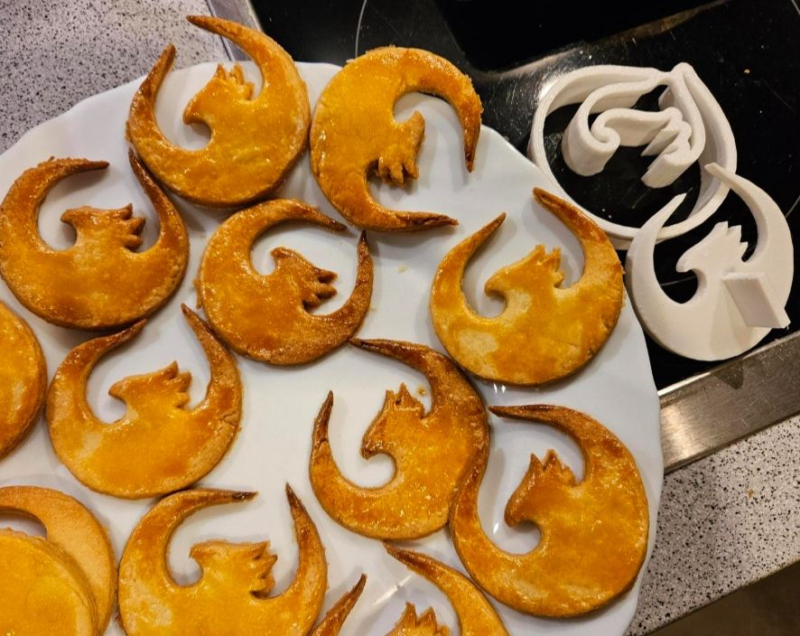

# "Buttergebackenes" (Butter Cookies)

Traditional recipe from the Baden region in southern Germany (and probably elsewhere as well).

## Ingredients

- 3 Egg Yolks
- 105 g Sugar
- 125 g Butter (unsalted, slightly warm to get softer)
- 250 g Flour (wheat, light, all-purpose, German Type 405)

## Instructions

1. Mix egg yolks, sugar and butter with a hand mixer, then add flour last after the rest has been mixed well.
2. When the dough is mixed, knead by hand to ensure a solid dough forms rather than a crumbly mixture.
3. Refrigerate the dough to make it easier to work with.
4. Preheat the oven to 180°C (350°F).
5. Roll out the dough on a floured surface (aim for slightly thinner than 0.5 cm).
6. Cut out cookies using the [UI5 Phoenix cutter](README.md##the-cookie-cutter) (press it well to ensure the dough is fully cut) and place them on a baking sheet (they can be quite close together as they won't expand much).
7. Brush the cookies with a mixture of 1/2 egg yolk and 1/3 tablespoon of milk.
8. Bake at 180°C (350°F) (top and bottom heat, no "Umluft" fan) for 11-15 minutes, until golden.
9. Share your result on https://bsky.app :-)

**Yield:** Approximately 3 baking sheets of cookies

## Example

These have come out a bit dark, but are still perfectly fine. Try to get them out of the oven before the wing tips get this brown, though.

